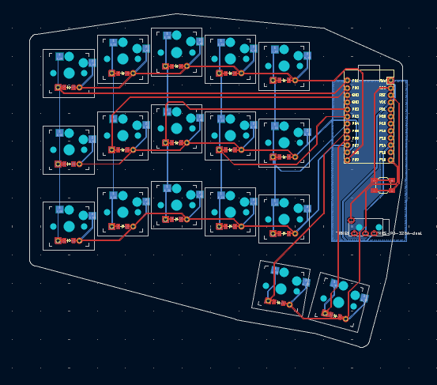
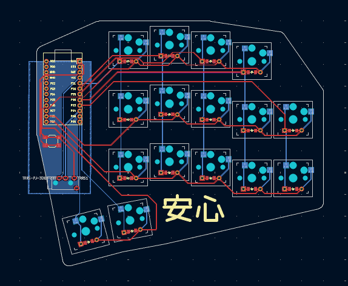

# Personal Split Keyboard

A 33-key split ergonomic keyboard designed with Ergogen and KiCad.

## PCB Preview

| Left Half | Right Half |
|-----------|------------|
|  |  |

## Layout

```
Left Hand (17 keys)                    Right Hand (16 keys)

     Q     W     E     R     T              Y     U     I     O
     A   ALT_S CTL_D SFT_F   G            SFT_H CTL_J ALT_K   L     P
   GUI_Z   X     C     V     B              N     M     ,   GUI_.   /
               [LOWER] [ENTER]          [SPACE] [RAISE]
```

- 5x3 matrix per hand with staggered columns
- Right pinky top key removed (reduced pinky strain)
- 2 thumb keys per hand with splay
- Home row mods on S, D, F, H, J, K, Z, .

## Parts List

| Component | Quantity | Notes |
|-----------|----------|-------|
| **Switches** | | |
| Kailh Choc v1 switches | 33 | Low-profile, PG1350 |
| Kailh Choc hotswap sockets | 33 | CPG135001S30 |
| **Keycaps** | | |
| Choc-compatible keycaps | 33 | 18mm x 17mm spacing |
| **Electronics** | | |
| RP2040 Pro Micro | 2 | Recommended (has onboard reset/boot buttons) |
| 1N4148 diodes | 33 | Through-hole or SMD (SOD-123) |
| TRRS jack (PJ-320A) | 2 | 4-pole, for split communication |
| Tactile reset button | 2 | Optional - SMD 5.2x5.2mm (SKQGABE010) |
| **Cables & Hardware** | | |
| TRRS cable | 1 | 4-pole, any length |
| USB-C cable | 1 | For connecting to computer |
| Rubber feet | 8-10 | Self-adhesive silicone bumpers |

## PCB Specifications

| Spec | Value |
|------|-------|
| Key spacing (X) | 18mm (standard Choc) |
| Key spacing (Y) | 17mm (standard Choc) |
| Switch cutout | 13.8mm x 13.8mm |
| PCB thickness | 1.6mm (standard) |
| Layers | 2 (F.Cu, B.Cu) |

### Column Stagger

| Finger | Stagger |
|--------|---------|
| Pinky | 0mm (baseline) |
| Ring | +5mm |
| Middle | +2.5mm |
| Index | -2.5mm |
| Inner | -2.5mm |

### Thumb Cluster

- Offset 27mm below index finger
- Outer thumb: 10 degrees splay
- Inner thumb: 5 degrees splay

## Build Instructions

### 1. Generate PCB Files

```bash
npx ergogen keyboard.yaml -o output
```

### 2. Open in KiCad

Open `output/pcbs/left_pcb.kicad_pcb` and `output/pcbs/right_pcb.kicad_pcb` in KiCad.

### 3. Route Traces

Complete the PCB routing in KiCad:
- Route columns on B.Cu (bottom layer)
- Route rows on F.Cu (top layer)
- Add ground pour on B.Cu
- Run DRC to check for errors

### 4. Manufacturing

Export Gerber files and submit to a PCB manufacturer:
- JLCPCB (budget, ships from China)
- Aisler (EU-based, no customs for UK/EU)
- PCBWay

### 5. Assembly Order

1. Solder diodes (observe polarity, bottom side)
2. Solder hotswap sockets (bottom side)
3. Solder TRRS jack
4. Solder reset button (optional)
5. Solder Pro Micro headers or directly
6. Insert switches into hotswap sockets
7. Add keycaps

## Firmware

This keyboard uses QMK firmware, based on my [Sofle personal keymap](https://github.com/juminuwo/sofle-personal-keymap).

### QMK File Structure

```
qmk/
├── config.h              # Keyboard-level config
├── info.json             # Keyboard definition (pins, matrix)
├── rules.mk              # Build rules
└── keymaps/
    └── default/
        ├── config.h      # Keymap-level config
        ├── keymap.c      # Keymap (based on Sofle)
        └── rules.mk      # Keymap features
```

### Keymap Layers

| Layer | Activation | Contents |
|-------|------------|----------|
| QWERTY | Default | Base layer with home row mods |
| QWERTY_PLAIN | Toggle | Base layer without home row mods |
| LOWER | Hold thumb | Numbers, symbols (!@#, {}, []) |
| RAISE | Hold thumb | Navigation (arrows), editing |
| ADJUST | LOWER+RAISE | Function keys, settings |

### Combos

| Keys | Output |
|------|--------|
| W + E | Backspace |
| U + I | Delete |
| N + M | Escape |
| C + V | Tab |

### Home Row Mods

| Key | Tap | Hold |
|-----|-----|------|
| S | s | Alt |
| D | d | Ctrl |
| F | f | Shift |
| H | h | Shift |
| J | j | Ctrl |
| K | k | Alt |
| Z | z | GUI |
| . | . | GUI |

### Pin Assignments

| Function | Left | Right |
|----------|------|-------|
| Columns (C0-C4) | GP1, GP0, GP2, GP3, GP4 | GP21, GP20, GP19, GP18, GP15 |
| Thumb cols (T0-T1) | GP5, GP6 | GP16, GP10 |
| Rows (R0-R3) | GP7, GP8, GP9, GP10 | GP9, GP8, GP7, GP6 |
| Serial (TRRS) | GP14 | GP14 |

Note: Right side uses different pins for easier PCB routing.

### Flashing Firmware

1. Copy `qmk/` folder to `qmk_firmware/keyboards/personal_split_33/`

2. Compile:
```bash
qmk compile -kb personal_split_33 -km default
```

3. Flash (put RP2040 in bootloader mode first):
```bash
qmk flash -kb personal_split_33 -km default
```

### Matrix

```
        C0    C1    C2    C3    C4    T0    T1
R0    [0,0] [0,1] [0,2] [0,3] [0,4]
R1    [1,0] [1,1] [1,2] [1,3] [1,4]
R2    [2,0] [2,1] [2,2] [2,3] [2,4]
R3                                  [3,5] [3,6]
```

## MCU Options

| Controller | Firmware | Features |
|------------|----------|----------|
| RP2040 Pro Micro | QMK | Recommended, onboard reset/boot buttons |
| ATmega32U4 Pro Micro | QMK | Classic, cheaper |
| nice!nano (nRF52840) | ZMK | Wireless/Bluetooth, battery support |

## Soldering Notes

### Equipment Needed
- Soldering iron with temperature control (320-350C)
- 0.8mm solder (60/40 rosin core or lead-free)
- Tweezers for SMD components
- Flux (optional but helpful)

### Safety
- Use ventilation or fume extractor
- Wash hands after soldering
- Don't eat/drink at workbench

## File Structure

```
personal_keyboard/
├── keyboard.yaml          # Ergogen configuration
├── README.md              # This file
├── CLAUDE.md              # Development notes
├── qmk/                   # QMK firmware
│   ├── config.h
│   ├── info.json
│   ├── rules.mk
│   └── keymaps/default/
│       ├── config.h
│       ├── keymap.c
│       └── rules.mk
└── output/
    ├── outlines/          # DXF plate files
    └── pcbs/              # KiCad PCB files
```

## License

MIT
